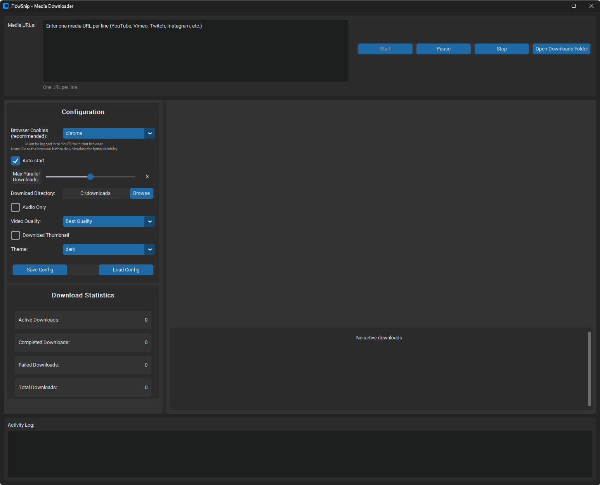

# FlowSnip

FlowSnip is a GUI wrapper for [yt-dlp](https://github.com/yt-dlp/yt-dlp).

## ⚠️ Legal Disclaimer

**FlowSnip is a GUI wrapper around yt-dlp. In other words, it's only just an user interface that calls out to yt-dlp! By using this tool, you acknowledge that you shall ONLY use it for accessing content that you have a legal right to access.** Users are solely responsible for ensuring their use complies with all applicable laws and the terms of service of content platforms. 

**Users assume all legal risk** associated with downloading, storing, or using any content from any platform using this tool. See [DISCLAIMER.md](DISCLAIMER.md) for full details.

## Screenshot



*FlowSnip's modern CustomTkinter interface with dark theme support*

## Features

### Core Functionality
- **Modern GUI** - Beautiful CustomTkinter interface with dark/light themes
- **Download Manager** - Complete parallel download engine with queue management
- **Configuration System** - Full Pydantic-based config with CLI overrides
- **Real-time Progress** - Live progress tracking with speed, ETA, and status

### Download Features
- **Parallel Processing** - Configurable concurrent downloads (1-10 simultaneous)
- **Video Quality Selection** - Easy selection: 360p, 480p, 720p, 1080p, 1440p, 4K
- **Audio-Only Downloads** - MP3 extraction with quality options (96-320 kbps)
- **Queue Management** - Add, pause, resume, cancel, retry downloads
- **Batch Processing** - Multiple URLs via copy-paste (newline separated)

### Configuration & Persistence
- **Auto-save Settings** - Window size and preferences persisted to config file
- **Configuration Files** - Import/export JSON configurations
- **Command Line Override** - Full CLI support for scripting

### Legal Acknowledgment
On startup, FlowSnip displays a legal disclaimer dialog that users must acknowledge. The dialog presents the key terms of responsibility and requires users to agree to proceed. If a user declines to agree, the application will exit gracefully. This ensures all users are aware of their legal obligations before using the tool.

## Getting Started

### Prerequisites
- Python 3.11 or higher
- Git
- **Node.js** *(optional)* — Required only for bypassing yt-dlp's n-challenge rate-limiting on some sites (e.g. YouTube throttling). Install from [nodejs.org](https://nodejs.org) or via your system package manager. If Node.js is installed to a non-standard location, set `FLOWSNIP_NODE_PATH=/path/to/node` before launching.

### Quick Start (Recommended)

For new developers, use the bootstrap target to set up your environment:

```bash
# Clone the repository
git clone git@github.com:rajeshsub/FlowSnip.git
cd FlowSnip

# Bootstrap the development environment
make bootstrap

# Run the application
uv run python -m flowsnip.main
```

### Using UV Directly

If you don't have `make` installed:

```bash
# Clone the repository
git clone git@github.com:rajeshsub/FlowSnip.git
cd FlowSnip

# Install UV (if not already installed)
pip install uv

# Sync dependencies
uv sync

# Run the application
uv run python -m flowsnip.main

# Run tests
uv run pytest --cov=flowsnip

# Lint and format code
uv run ruff check --fix flowsnip tests
uv run ruff format flowsnip tests
```

### Legacy: Using pip

```bash
# Clone the repository
git clone git@github.com:rajeshsub/FlowSnip.git
cd FlowSnip

# Create virtual environment
python -m venv .venv

# Activate virtual environment
# Windows:
.venv\Scripts\activate
# Linux/Mac:
source .venv/bin/activate

# Install dependencies
pip install -r requirements.txt

# Run the application
python -m flowsnip.main
```

## Configuration

```bash
# Test different configurations
python -m flowsnip.main --download-dir ~/Videos
python -m flowsnip.main --quality "best[height<=720]"
python -m flowsnip.main --audio-only --audio-quality 320
python -m flowsnip.main --max-parallel 5 --theme light
```

### Environment Variables

| Variable | Description |
|---|---|
| `FLOWSNIP_NODE_PATH` | Full path to the `node` executable (e.g. `/usr/local/bin/node` or `C:\nvm\node.exe`). Used when Node.js is installed to a non-standard location. If not set, FlowSnip searches `PATH` then common install locations automatically. |

### Code Quality Management
```bash
# Format code
black flowsnip tests

# Sort imports  
isort flowsnip tests

# Lint code
flake8 flowsnip tests

# Type checking
mypy flowsnip
```

### Automated tests with Pytest
```bash
# Run tests (when implemented)
pytest

# Run with coverage
pytest --cov=flowsnip
```

## Architecture

```
FlowSnip/
├── flowsnip/               # Main package
│   ├── __init__.py         # Package initialization
│   ├── config.py           # Configuration management
│   ├── main.py             # Application entry point
│   ├── download_manager.py # Download queue processing
│   └── gui.py              # GUI interface
├── tests/                  # Test suite framework
├── .venv/                  # Virtual environment
├── pyproject.toml          # Project configuration
└── README.md               # This file
```

## Contributing

Contributions welcome! :-)

## License

MIT License - see LICENSE file for details.
